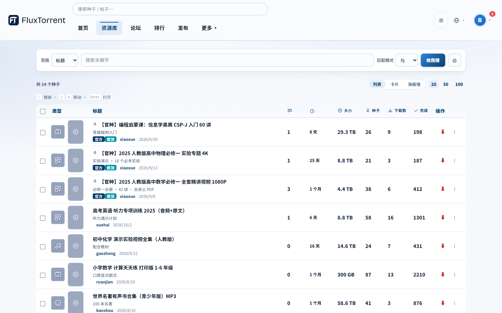
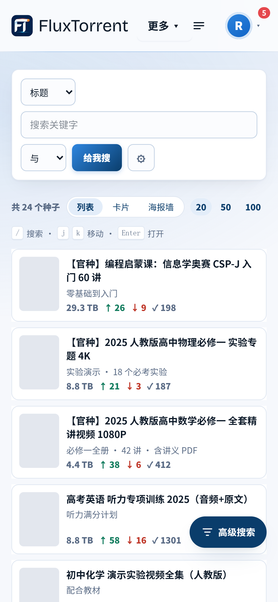
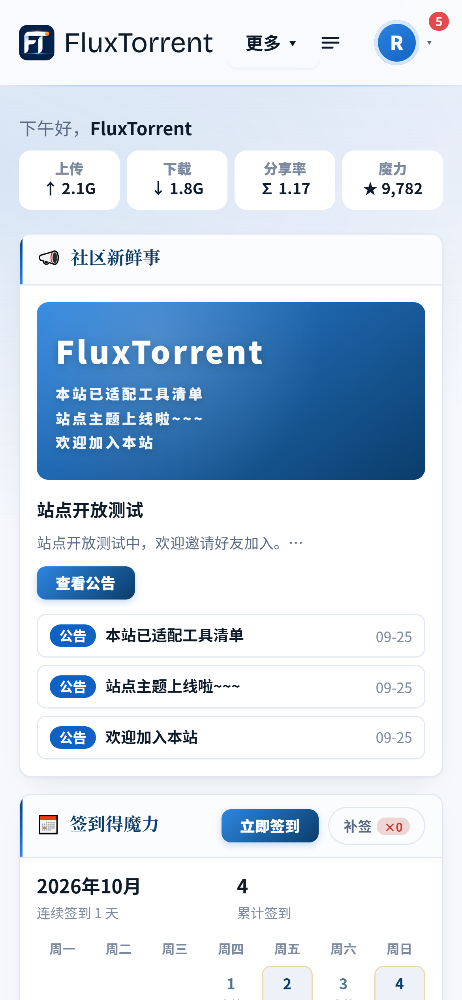
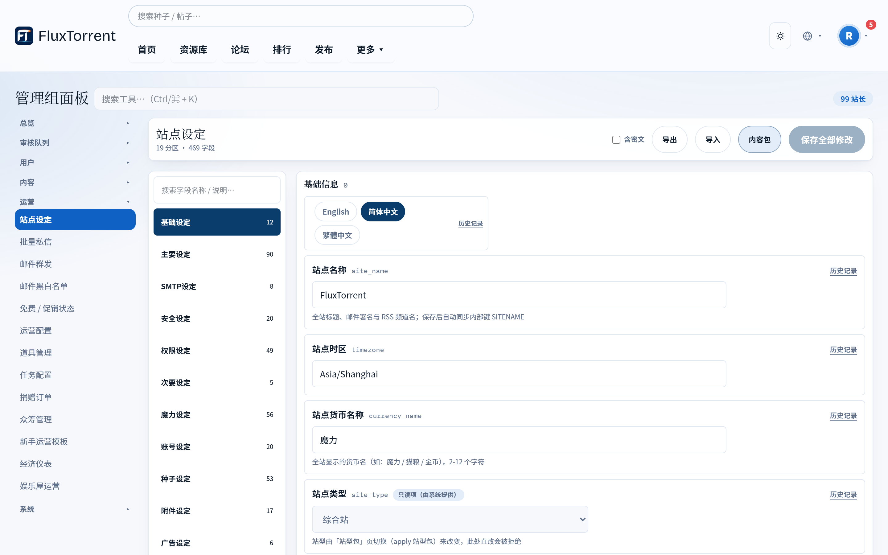
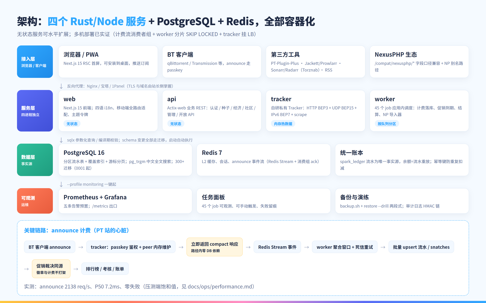

# FluxTorrent：一套开源的 PT 建站系统

**先说人话**：PT 站就是那种要邀请码才能进、会记录你上传下载量的资源站。FluxTorrent 是拿来**开一个 PT 站**的程序——不是某个站的源码，是可以反复用来搭站的那层东西。MIT 协议，随便用。

三件最要紧的：

- **想建什么类型的站都行**：影音、音乐、动漫、电子书、教育、纪录片、无损、游戏、软件、体育、综合，11 种起点，选一个开始，之后全部能改。
- **不用改代码就能定制**：加字段、开关功能、改页面菜单、改叫法改配色，都在后台点。
- **一台机器一条命令起站**：Docker，五分钟级别。

仓库：<https://github.com/gntv456/FluxTorrent> ｜ 文档：<https://wiki.ptang.top/ft/>

---

## 长这样

资源库列表：分类色块 + 五行筛选，列表 / 卡片 / 海报墙三种看法。



娱乐屋九款玩法（猜大小、刮刮乐、九宫格、扭蛋、大转盘、农场、抽卡、宠物、钓鱼），赚来的魔力有地方花。


手机端不是阉割版：同一套功能和字段，底部五个 Tab。

 

---

## 后台能改什么



- **加字段**：六种类型（文字 / 数字 / 单选 / 多选 / 日期 / 是否）。要不要出现在注册页、给不给别人看、挂在哪个功能下，全是勾选。
- **开关功能**：30 多个模块，关掉一个，前台后台一起消失，不会留半截入口。
- **改叫法**：站里货币默认叫「魔力」，想叫「火花」「积分」「硬币」是改一条设定，不是全局替换文字。
- **改外观**：颜色、圆角、字体全走令牌，明暗两套主题。
- **自己加页面和菜单**：新站自带的 7 页新手帮助，就是这么加出来的。

---

## 装起来多简单

```bash
cp docker/.env.example docker/.env    # 填三个密码
docker compose -f docker/docker-compose.yml up -d
# 浏览器打开 http://localhost:3000/setup，跟着向导四步走完
```


宝塔、1Panel、离线包、域名 HTTPS 都有手册。升级就是拉最新代码再起一次，数据库的改动会自动跟上——前提是你没改它的代码。

---

## 跑得快不快

不吹参数，说人话：一个站几万人、几十万种子这个量级，它扛得住。

- Tracker（记录谁在做种、给你算流量的那个服务）实测每秒 **2138 次心跳、零失败**，平均响应 **7.2 毫秒**。
- 心跳这条路上不碰数据库，所以人再多也不会把站拖死；流量是后台攒批算的，重启不丢账。
- 免费、2X 这类促销，列表上的徽章和实际扣的流量读同一份数据，不会出现「显示免费照样扣」。



---

## 适合谁，不适合谁

**适合**：想自己开站的站长；觉得「加功能就得改代码」太累的运营；做第三方工具、想找个能随便起的测试站的人。

**不适合**：

- 想直接找个站加入的——这是建站工具，不是站。
- 完全没碰过 Docker 命令行、也不想照手册抄的。
- 介意「机会类小游戏」合规责任要自己担的（安装向导第四步就是确认这条，介意可以整块关掉）。
- 介意项目还在 0.x 的：小版本之间仍有改动，生产站请盯更新日志。

---

## 有问题直接说

想先看到哪个功能、或者哪条口径不对，跟帖或开 issue 都行。想看更多界面，文档分站长 / 用户 / 自定义 / 运维四册。
